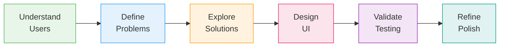

# UI Optimizer

**You design. AI ships.**

Turn AI agents into product designers—not just UI generators.

## Quick Start

```bash
# View the docs
git clone https://github.com/smileynet/ui-optimizer.git
cd ui-optimizer
pip install -r requirements.txt
mkdocs serve
# → http://localhost:8000
```

```bash
# Run the interactive demo
cd ui-design-demo
bun install && bun run dev
# → http://localhost:5173
```

## What You Get

| Component | Description |
|-----------|-------------|
| **Product Design Docs** | JTBD, personas, user stories, journey maps |
| **UI Design Docs** | Design systems, tokens, accessibility, atomic design |
| **Agent Workflow** | 6-phase process with prompts and quality gates |
| **Interactive Demo** | Persona-driven UI patterns in action |

## How It Works



Each phase has a specialized agent, structured outputs, and quality gates.

## Documentation

| Section | What You'll Learn |
|---------|-------------------|
| [Product Design](docs/product-design/README.md) | Jobs-to-be-Done, personas, user stories, journey maps |
| [UI Design](docs/ui-design/README.md) | Design systems, tokens, accessibility, atomic design |
| [Agent Workflow](docs/workflow/README.md) | 6-phase process for AI-driven UI creation |
| [Agent Prompts](docs/workflow/agent-prompts.md) | Copy-paste prompts for each workflow phase |

## Interactive Demo

See how the same interface adapts to different users:

| Example | Personas | Pattern |
|---------|----------|---------|
| Dashboard | Executive, Analyst | Progressive Disclosure |
| Settings | Power User, Casual | Layered Complexity |
| E-commerce | Quick Buyer, Researcher | Parallel Paths |
| Data Table | Data Analyst, Team Lead | Context-Aware Revelation |

Toggle between personas to see UI elements appear/hide based on user needs.

## Contributing

1. Use design tokens (no hardcoded values)
2. Follow existing component patterns
3. Docs follow [Diataxis](https://diataxis.fr/) structure

See [Contributing docs](docs/contributing/) for diagram guidelines.

## License

[MIT](LICENSE)
