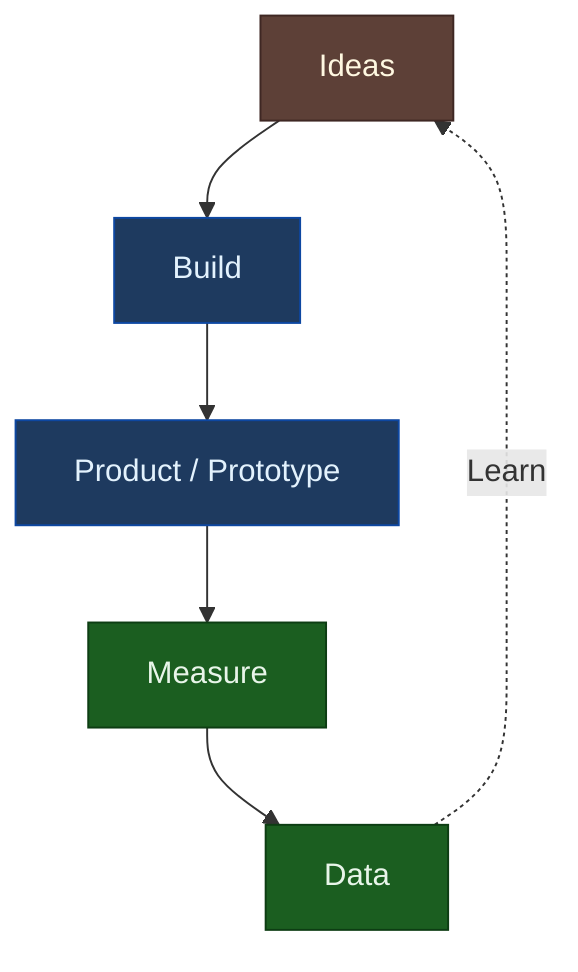
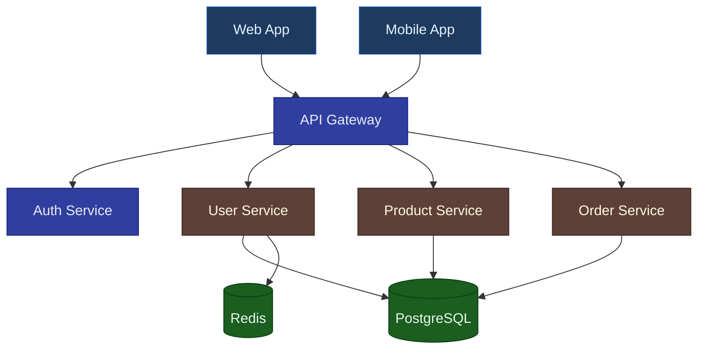
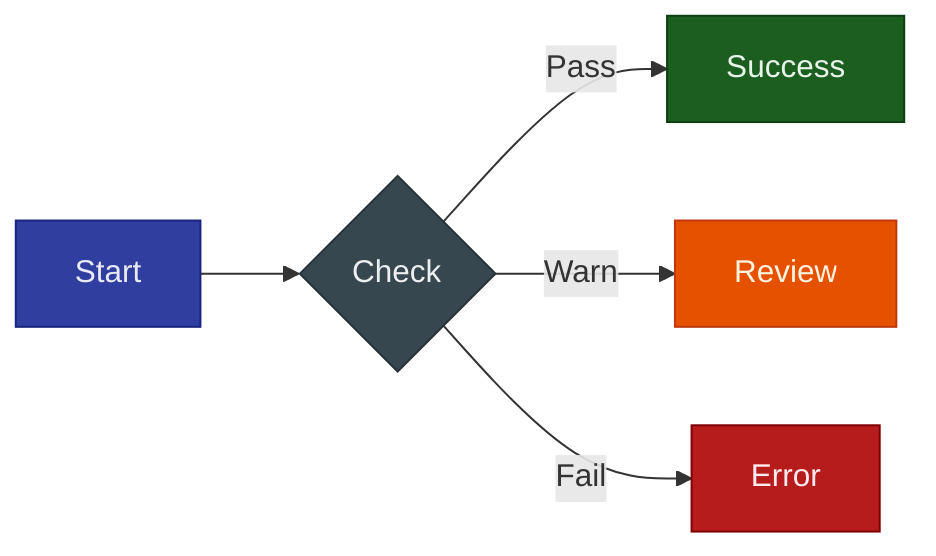

# Diagram Tools Comparison

This page demonstrates different diagram rendering options available in this documentation.

## Quick Comparison

| Tool | Strengths | Best For |
|------|-----------|----------|
| **Mermaid** | Built-in, simple syntax, GitHub compatible | Quick diagrams, flowcharts |
| **D2** | Professional output, unified syntax, sketch mode | Architecture, polished docs |
| **Kroki** | 24+ diagram types via one API | Specialized diagrams (future) |

---

## Example: Agent Workflow

### Mermaid Version


### D2 Version

```d2
direction: right

orchestrator: ORCHESTRATOR {
  style.fill: "#303F9F"
  style.stroke: "#1A237E"
  style.font-color: "#E8EAF6"
}

p1: Phase 1 Research {
  style.fill: "#1E3A5F"
  style.stroke: "#0D47A1"
  style.font-color: "#E3F2FD"
}
p2: Phase 2 Strategy {
  style.fill: "#1E3A5F"
  style.stroke: "#0D47A1"
  style.font-color: "#E3F2FD"
}
p3: Phase 3 Solution {
  style.fill: "#1E3A5F"
  style.stroke: "#0D47A1"
  style.font-color: "#E3F2FD"
}
p4: Phase 4 UI Design {
  style.fill: "#5D4037"
  style.stroke: "#3E2723"
  style.font-color: "#FFF8E1"
}
p5: Phase 5 Critique {
  style.fill: "#B71C1C"
  style.stroke: "#7F0000"
  style.font-color: "#FFEBEE"
}
p6: Phase 6 Polish {
  style.fill: "#1B5E20"
  style.stroke: "#0D3D13"
  style.font-color: "#E8F5E9"
}

orchestrator -> p1
p1 -> p2 -> p3 -> p4 -> p5 -> p6
```

---

## Example: Build-Measure-Learn Loop

### Mermaid Version



### D2 Version

```d2
direction: down

ideas: Ideas {
  style.fill: "#5D4037"
  style.stroke: "#3E2723"
  style.font-color: "#FFF8E1"
}
build: Build {
  style.fill: "#1E3A5F"
  style.stroke: "#0D47A1"
  style.font-color: "#E3F2FD"
}
product: Product (prototype) {
  style.fill: "#1E3A5F"
  style.stroke: "#0D47A1"
  style.font-color: "#E3F2FD"
}
measure: Measure {
  style.fill: "#1B5E20"
  style.stroke: "#0D3D13"
  style.font-color: "#E8F5E9"
}
data: Data {
  style.fill: "#1B5E20"
  style.stroke: "#0D3D13"
  style.font-color: "#E8F5E9"
}

ideas -> build -> product -> measure -> data
data -> ideas: Learn {
  style.stroke-dash: 5
}
```

---

## Example: Architecture Diagram

### Mermaid Version



### D2 Version

```d2
direction: down

client: Client Layer {
  style.fill: "#1E3A5F"
  style.stroke: "#0D47A1"
  style.font-color: "#E3F2FD"
  web: Web App
  mobile: Mobile App
}

api: API Layer {
  style.fill: "#303F9F"
  style.stroke: "#1A237E"
  style.font-color: "#E8EAF6"
  gateway: API Gateway
  auth: Auth Service
}

services: Service Layer {
  style.fill: "#5D4037"
  style.stroke: "#3E2723"
  style.font-color: "#FFF8E1"
  users: User Service
  products: Product Service
  orders: Order Service
}

data: Data Layer {
  style.fill: "#1B5E20"
  style.stroke: "#0D3D13"
  style.font-color: "#E8F5E9"
  db: PostgreSQL {
    shape: cylinder
  }
  cache: Redis {
    shape: cylinder
  }
}

client.web -> api.gateway
client.mobile -> api.gateway
api.gateway -> api.auth
api.gateway -> services.users
api.gateway -> services.products
api.gateway -> services.orders
services.users -> data.db
services.products -> data.db
services.orders -> data.db
services.users -> data.cache
```

---

## Example: D2 Sketch Mode

D2 supports a hand-drawn "sketch" mode for a more informal feel:

```d2
# This would render in sketch mode if configured

user: User {
  shape: person
  style.fill: "#1E3A5F"
  style.stroke: "#0D47A1"
  style.font-color: "#E3F2FD"
}

app: Application {
  style.fill: "#37474F"
  style.stroke: "#263238"
  style.font-color: "#ECEFF1"
  ui: Frontend
  api: Backend API
  db: Database {
    shape: cylinder
  }
}

user -> app.ui: Uses
app.ui -> app.api: REST calls
app.api -> app.db: Queries
```

---

## Mermaid Styling Patterns

### Using classDef (Recommended)

Define reusable style classes for semantic meaning:



### Workflow Phases Example


### Built-in Themes

MkDocs Material automatically handles light/dark mode. For reference, Mermaid's built-in themes:

| Theme | Best For |
|-------|----------|
| `default` | Standard light documentation |
| `dark` | Dark mode interfaces |
| `neutral` | Print/black-white |
| `forest` | Green-themed |
| `base` | Custom styling only |

---

## Recommendations

### Use Mermaid When:
- Quick diagrams needed
- GitHub README compatibility required
- Simple flowcharts or sequence diagrams
- Built-in theme integration is sufficient

### Use D2 When:
- Professional/polished output needed
- Complex architecture diagrams
- Consistent styling across many diagrams
- Hand-drawn sketch style desired

---

## Future: Kroki Integration

Kroki provides a unified API for 24+ diagram types. See [Kroki Setup Guide](./kroki-setup.md) for future integration instructions.

Supported diagram types include:
- BlockDiag, SeqDiag, ActDiag, NwDiag
- PlantUML (all UML types)
- C4 architecture diagrams
- Graphviz/DOT
- Mermaid
- D2
- Excalidraw
- And many more...
