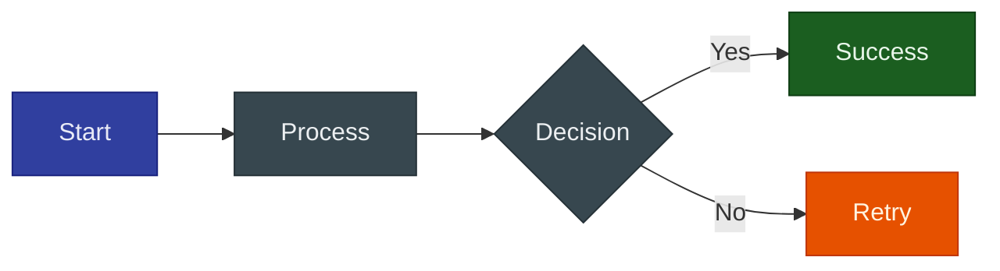
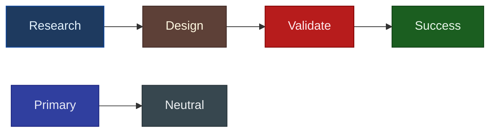
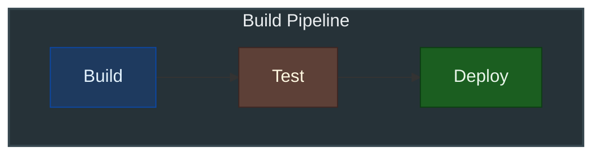

# Diagram Style Guide

This guide documents conventions for creating diagrams in this documentation. Following these patterns ensures consistency, maintainability, and proper rendering across light/dark modes.

## Quick Reference

| Aspect | Mermaid | D2 |
|--------|---------|-----|
| **Multi-line labels** | Avoid (use single-line) | Use block strings (`\|md ... \|`) |
| **Styling** | Use `classDef` | Use themes (avoid inline styles) |
| **Themes** | Let MkDocs Material handle | `theme: 0`, `dark_theme: 200` |
| **Best for** | Quick diagrams, GitHub compat | Architecture, polished output |

---

## Mermaid Conventions

### Critical Syntax Rules

!!! danger "Text Color Gotchas"
    Mermaid's `color` property (text color) fails silently in many situations, resulting in **white text on light backgrounds**. Follow these rules precisely.

#### Rule 1: Define Nodes SEPARATELY from Edges

The `color` property in `classDef` only works reliably when nodes are defined on their **own lines**, separate from edge definitions.

**CORRECT** - Nodes defined separately, then connected:


**WRONG** - Mixing node definitions with edges (causes white/invisible text):

```text
flowchart LR
    classDef phase fill:#DBEAFE,stroke:#3B82F6,color:#1E40AF
    
    %% DON'T do this - text color will be ignored!
    A[Phase 1: Research]:::phase --> B[Phase 2: Strategy]:::phase
```

#### Rule 2: Use Inline `:::class` Syntax

Apply classes using the inline `:::className` syntax immediately after the node definition. The `class A,B,C className` statement at the end of diagrams is **unreliable** for text color.

**CORRECT:**


**UNRELIABLE:**
```text
flowchart LR
    classDef research fill:#1E3A5F,stroke:#0D47A1,color:#E3F2FD
    
    A[Research]
    B[Analysis]
    A --> B
    
    class A,B research  %% Text color may not apply!
```

#### Rule 3: Avoid Reserved Words

`error` is a reserved word in Mermaid. Use `errorStyle` instead.

```text
%% WRONG - 'error' is reserved
classDef error fill:#FFEBEE,stroke:#F44336,color:#B71C1C

%% CORRECT
classDef errorStyle fill:#FFEBEE,stroke:#F44336,color:#B71C1C
```

#### Rule 4: No HTML in Labels

HTML tags like `<br/>` and escape sequences like `\n` get escaped by MkDocs. Use single-line labels.

```text
# AVOID - HTML gets escaped
A["Phase 1<br/>Research"] --> B["Phase 2<br/>Strategy"]
```

---

### Label Formatting

**Do:** Use simple, single-line labels with classes applied on separate lines


---

### Supported CSS Properties

| Property | Purpose | Example | Works? |
|----------|---------|---------|--------|
| `fill` | Background color | `fill:#f9f` | Yes |
| `stroke` | Border color | `stroke:#333` | Yes |
| `stroke-width` | Border thickness | `stroke-width:4px` | Yes |
| `color` | Text color | `color:#fff` | Partial (see rules above) |
| `font-size` | Font size | `font-size:12pt` | Yes |
| `font-weight` | Font weight | `font-weight:bold` | Yes |
| `font-style` | Font style | `font-style:italic` | Yes |
| `stroke-dasharray` | Dashed lines | `stroke-dasharray:5 5` | Yes |
| `fill-opacity` | Transparency | `fill-opacity:0.5` | Yes |

**Properties that DON'T work:** `background` (use `fill`), `border` (use `stroke`), `padding`, `margin`, `text-align`

---

### Styling with classDef

Define reusable style classes. Always define nodes on separate lines from edges:



### Recommended Class Definitions

Copy-paste these semantic class definitions (dark theme, indigo-aligned):



### Complete Class Library

```text
%% Copy this block to the top of your Mermaid diagrams
%% Dark theme (indigo-aligned for MkDocs Material)

%% Phase colors (for workflows) - Dark fills, light text
classDef research fill:#1E3A5F,stroke:#0D47A1,color:#E3F2FD
classDef design fill:#5D4037,stroke:#3E2723,color:#FFF8E1
classDef validate fill:#B71C1C,stroke:#7F0000,color:#FFEBEE
classDef success fill:#1B5E20,stroke:#0D3D13,color:#E8F5E9

%% Role colors (for actors/components)
classDef primary fill:#303F9F,stroke:#1A237E,color:#E8EAF6
classDef neutral fill:#37474F,stroke:#263238,color:#ECEFF1

%% Status colors
classDef errorStyle fill:#B71C1C,stroke:#7F0000,color:#FFEBEE
classDef warning fill:#E65100,stroke:#BF360C,color:#FFF3E0
classDef info fill:#01579B,stroke:#002F6C,color:#E1F5FE
```

### Theme Configuration

Let MkDocs Material handle theming automatically. Avoid setting explicit themes unless needed:

```text
%% AVOID: Forces a specific theme
%%{init: {'theme': 'dark'}}%%
flowchart LR
    A --> B --> C
```

**PREFER:** Let Material handle light/dark mode automatically - don't specify a theme.

### Subgraph Styling

!!! warning "Subgraphs Don't Support classDef"
    Subgraphs cannot use `classDef` - use `style` statement instead.



---

### Anti-Patterns to Avoid

| Anti-Pattern | Problem | Solution |
|--------------|---------|----------|
| Mixing node definition with edges | Text color fails | Define nodes on separate lines |
| Using `class A,B name` at end | Text color unreliable | Use inline `:::class` syntax |
| Using `classDef` on subgraphs | Not supported | Use `style SubgraphId fill:...` |
| Reserved word `error` | Parser errors | Use `errorStyle` |
| Lowercase `end` | Keyword conflict | Use `End` or `END` |
| Leading `o` or `x` in labels | Circle/cross markers | Add space: `A --- onboarding` |
| HTML in labels (`<br/>`) | Gets escaped | Use single-line labels |
| Inline styles | Hard to maintain | Use `classDef` classes |
| Hardcoded colors | Inconsistent | Use semantic class names |
| Over-complex diagrams | Hard to read | Break into smaller diagrams |
| Empty subgraphs | Rendering issues | Ensure subgraphs have content |

---

## D2 Conventions

### Critical: Classes Don't Work with mkdocs-d2-plugin

!!! danger "D2 Classes Feature Broken"
    D2's `classes:` feature is **completely ignored** by mkdocs-d2-plugin v0.7.1. Custom colors defined in classes will not render. Use inline `style.*` properties instead.

**DOES NOT WORK** (colors ignored, uses theme defaults):
```text
# This looks correct but DOESN'T WORK with mkdocs-d2-plugin
classes: {
  research: {
    style.fill: "#DBEAFE"
    style.stroke: "#3B82F6"
    style.font-color: "#1E40AF"
  }
}

node1.class: research  # Ignored!
```

**WORKS** - Use inline styles (dark theme):
```d2
node1: Research {
  style.fill: "#1E3A5F"
  style.stroke: "#0D47A1"
  style.font-color: "#E3F2FD"
}
```

---

### Complete Style Properties

**Color & Fill:**

| Property | Purpose | Values | Applies To |
|----------|---------|--------|------------|
| `style.fill` | Background color | Hex with quotes: `"#DBEAFE"` | Shapes only |
| `style.stroke` | Border color | Hex with quotes: `"#3B82F6"` | All |
| `style.opacity` | Transparency | Float 0-1: `0.5` | All |
| `style.fill-pattern` | Background pattern | `dots`, `lines`, `grain`, `paper` | Shapes only |

**Border & Shape:**

| Property | Purpose | Values | Applies To |
|----------|---------|--------|------------|
| `style.stroke-width` | Border thickness | Integer 1-15: `2` | All |
| `style.stroke-dash` | Dashed border | Integer 0-10: `5` | All |
| `style.border-radius` | Rounded corners | Integer 0-20: `8` | Rectangles |
| `style.shadow` | Drop shadow | Boolean: `true` | Shapes only |
| `style.3d` | 3D effect | Boolean: `true` | Rectangles only |
| `style.double-border` | Double outline | Boolean: `true` | Rectangles, ovals |
| `style.multiple` | Multiple instances | Boolean: `true` | Shapes only |

**Typography:**

| Property | Purpose | Values | Applies To |
|----------|---------|--------|------------|
| `style.font-color` | Text color | Hex with quotes: `"#1E40AF"` | All |
| `style.font-size` | Text size | Integer 8-100: `14` | All |
| `style.bold` | Bold text | Boolean: `true` | All |
| `style.italic` | Italic text | Boolean: `true` | All |
| `style.underline` | Underlined text | Boolean: `true` | All |
| `style.text-transform` | Case change | `uppercase`, `lowercase`, `capitalize` | All |

**Animation:**

| Property | Purpose | Values | Applies To |
|----------|---------|--------|------------|
| `style.animated` | Animated dash | Boolean: `true` | Connections only |

!!! warning "Hex Colors Must Be Quoted"
    Always quote hex colors: `style.fill: "#DBEAFE"` not `style.fill: #DBEAFE`

---

### Label Formatting

**Do:** Use block strings with markdown for multi-line labels

```d2
node: |md
  **Title**
  Description text
|
```

**Don't:** Use `\n` escape sequences

```d2
# AVOID
node: Title\nDescription
```

---

### Container Structure

Use containers to group related elements:

```d2
direction: down

frontend: Frontend {
  web: Web App
  mobile: Mobile App
}

backend: Backend {
  api: API Server
  db: Database {
    shape: cylinder
  }
}

frontend.web -> backend.api
frontend.mobile -> backend.api
backend.api -> backend.db
```

---

### Styling Example with Inline Styles

Since classes don't work, apply styles inline (dark theme, indigo-aligned):

```d2
phase1: Research {
  style.fill: "#1E3A5F"
  style.stroke: "#0D47A1"
  style.font-color: "#E3F2FD"
}
phase2: Design {
  style.fill: "#5D4037"
  style.stroke: "#3E2723"
  style.font-color: "#FFF8E1"
}
phase3: Validate {
  style.fill: "#B71C1C"
  style.stroke: "#7F0000"
  style.font-color: "#FFEBEE"
}
phase4: Complete {
  style.fill: "#1B5E20"
  style.stroke: "#0D3D13"
  style.font-color: "#E8F5E9"
}

phase1 -> phase2 -> phase3 -> phase4
```

### Copy-Paste Style Snippets

Since you can't use classes, copy these style blocks as needed (dark theme):

```text
# Research/Understand phase (dark blue)
style.fill: "#1E3A5F"
style.stroke: "#0D47A1"
style.font-color: "#E3F2FD"

# Design/Create phase (dark amber)
style.fill: "#5D4037"
style.stroke: "#3E2723"
style.font-color: "#FFF8E1"

# Validate/Test phase (dark red)
style.fill: "#B71C1C"
style.stroke: "#7F0000"
style.font-color: "#FFEBEE"

# Complete/Success phase (dark green)
style.fill: "#1B5E20"
style.stroke: "#0D3D13"
style.font-color: "#E8F5E9"

# Primary/Orchestrator (indigo)
style.fill: "#303F9F"
style.stroke: "#1A237E"
style.font-color: "#E8EAF6"

# Neutral (dark blue-grey)
style.fill: "#37474F"
style.stroke: "#263238"
style.font-color: "#ECEFF1"
```

### Semantic Color Palette (Dark Theme)

Use these dark colors to match the MkDocs Material indigo theme:

| Purpose | Fill (Dark) | Stroke (Darker) | Text (Light) |
|---------|-------------|-----------------|--------------|
| **Research/Understand** | `#1E3A5F` | `#0D47A1` | `#E3F2FD` |
| **Design/Create** | `#5D4037` | `#3E2723` | `#FFF8E1` |
| **Validate/Test** | `#B71C1C` | `#7F0000` | `#FFEBEE` |
| **Complete/Success** | `#1B5E20` | `#0D3D13` | `#E8F5E9` |
| **Orchestrator/Primary** | `#303F9F` | `#1A237E` | `#E8EAF6` |
| **Secondary/Neutral** | `#37474F` | `#263238` | `#ECEFF1` |

### Theme Configuration

Our mkdocs.yml configuration:

- Light mode: `theme: 0` (Neutral Default)
- Dark mode: `dark_theme: 200` (Dark Mauve)

When inline styles are needed for special cases:

```d2
# Only for special emphasis
critical: Critical Path {
  style.stroke: "#D32F2F"
  style.stroke-width: 3
}
```

### Layout Engine

We use **ELK** (`layout: elk`) for:

- Better handling of complex hierarchies
- More professional appearance
- Consistent spacing

### Special Shapes

**Available shapes:**

| Shape | Use For | Example |
|-------|---------|---------|
| `rectangle` | Default, general nodes | Components |
| `square` | Equal dimensions | Icons |
| `circle` | 1:1 aspect ratio | Status |
| `oval` | Rounded | Start/End |
| `diamond` | Decisions | Conditionals |
| `hexagon` | Processing | Workers |
| `cylinder` | Data stores | Databases |
| `queue` | Message queues | Event streams |
| `cloud` | External services | APIs |
| `person` | Users/Actors | C4 diagrams |
| `package` | Modules | Containers |
| `page` | Documents | Reports |
| `parallelogram` | I/O | Data flow |
| `document` | Files | Exports |
| `stored_data` | Data at rest | Cache |
| `step` | Sequential | Pipelines |
| `callout` | Annotations | Notes |

```d2
# Use semantic shapes
user: User {
  shape: person
}

database: Storage {
  shape: cylinder
}

cloud: Cloud Service {
  shape: cloud
}

process: Background Job {
  shape: hexagon
}
```

### Connection Styles

```d2
# Solid connection (default)
a -> b

# Dashed connection
a -> b: {
  style.stroke-dash: 5
}

# Animated connection
a -> b: {
  style.animated: true
}

# Bidirectional
a <-> b

# Multiple labels
a -> b: label1
a -> b: label2
```

### Arrowhead Styles

**Available arrowheads:** `triangle` (default), `arrow`, `diamond`, `circle`, `cf-one`, `cf-many`, `cf-one-required`, `cf-many-required`

```d2
# Custom arrowheads
a -> b: {
  source-arrowhead: {
    shape: diamond
  }
  target-arrowhead: {
    shape: circle
  }
}

# Crow's foot (ERD notation)
user -> orders: {
  target-arrowhead: {
    shape: cf-many
  }
}
```

---

## When to Use Which Tool

### Use Mermaid For:

- Simple flowcharts
- Sequence diagrams
- Quick documentation diagrams
- GitHub README compatibility
- Diagrams that need to work without plugins

### Use D2 For:

- Architecture diagrams
- Complex system overviews
- Professional/publication-ready output
- Diagrams with containers/grouping
- When you need sketch mode

---

## File Organization

```
docs/
├── reference/
│   ├── diagram-comparison.md    # Tool comparison
│   └── diagram-style-guide.md   # This file
└── **/*.md                      # Inline diagrams in docs
```

For complex diagrams that are reused, consider:

1. Creating standalone `.d2` files
2. Using the image tag syntax: ``

---

## Accessibility Considerations

### WCAG Color Contrast Requirements

| Content Type | AA (Minimum) | AAA (Enhanced) |
|--------------|--------------|----------------|
| Normal text (under 18pt) | 4.5:1 | 7:1 |
| Large text (18pt+ or 14pt bold) | 3:1 | 4.5:1 |
| UI Components/Graphics | 3:1 | - |

### Accessible Color Combinations

Our dark semantic palette is designed for WCAG AA compliance (light text on dark backgrounds):

| Color Pair | Contrast Ratio | Status |
|------------|----------------|--------|
| `#E3F2FD` on `#1E3A5F` (Research) | ~10:1 | AAA |
| `#FFF8E1` on `#5D4037` (Design) | ~8:1 | AAA |
| `#FFEBEE` on `#B71C1C` (Validate) | ~6:1 | AA |
| `#E8F5E9` on `#1B5E20` (Success) | ~8:1 | AAA |
| `#E8EAF6` on `#303F9F` (Primary) | ~7:1 | AAA |
| `#ECEFF1` on `#37474F` (Neutral) | ~8:1 | AAA |

### Best Practices

1. **Color contrast** - All our semantic colors meet 4.5:1 minimum
2. **Don't rely on color alone** - Use shapes, labels, patterns
3. **Alt text** - Provide context in surrounding prose
4. **Keep it simple** - Complex diagrams are harder for screen readers
5. **Test with tools** - Use [WebAIM Contrast Checker](https://webaim.org/resources/contrastchecker/)

---

## Configuration Reference

### mkdocs.yml D2 Settings

```yaml
plugins:
  - d2:
      executable: /path/to/d2
      layout: elk           # dagre, elk, or tala
      theme: 0              # Light theme (0-17)
      dark_theme: 200       # Dark theme (200-201)
      sketch: false         # Hand-drawn style
      pad: 100              # Padding around diagram
      scale: 0.8            # Scale factor
```

### Available D2 Themes

**Light themes:** 0 (Neutral Default), 1-17 (various styles)
**Dark themes:** 200 (Dark Mauve), 201 (Dark Flagship)

See [D2 Themes](https://d2lang.com/tour/themes/) for full catalog.
