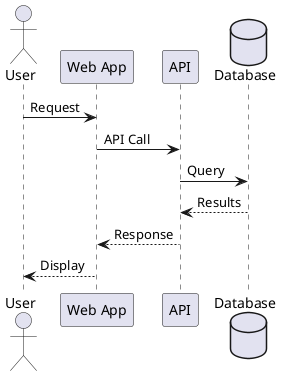
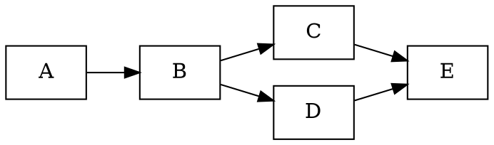

# Kroki Setup Guide

> **Status**: Future reference - not currently enabled in this project.

Kroki is a unified API that renders 24+ diagram types from text descriptions. This guide documents how to set it up when needed.

## Why Kroki?

| Benefit | Description |
|---------|-------------|
| **One plugin, many formats** | Access PlantUML, Graphviz, Mermaid, D2, and 20+ more |
| **Server-side rendering** | No JavaScript required in browser |
| **Consistent API** | Same fenced code block syntax for all types |
| **Self-hostable** | Run your own Kroki server for privacy/speed |

## Supported Diagram Types

### UML Diagrams
- Sequence diagrams (PlantUML, Mermaid, SeqDiag)
- Class diagrams (PlantUML, Mermaid)
- Activity diagrams (PlantUML, ActDiag)
- Use case diagrams (PlantUML)
- State diagrams (PlantUML, Mermaid)
- Component diagrams (PlantUML)
- Deployment diagrams (PlantUML)

### Architecture
- C4 model diagrams (PlantUML with C4 extension)
- Network diagrams (NwDiag)
- Block diagrams (BlockDiag)
- Packet diagrams (PacketDiag)
- Rack diagrams (RackDiag)

### Other
- Graphviz/DOT
- Mermaid (all types)
- D2
- Excalidraw
- Ditaa (ASCII to diagram)
- Erd (Entity Relationship)
- Nomnoml
- Pikchr
- Structurizr
- Svgbob (ASCII to SVG)
- UMlet
- Vega/Vega-Lite (data visualization)
- WaveDrom (digital timing)

## Installation

### 1. Install the MkDocs plugin

```bash
uv pip install mkdocs-kroki-plugin
```

### 2. Add to mkdocs.yml

```yaml
plugins:
  - kroki:
      ServerURL: https://kroki.io  # Public server (or self-hosted)
      EnableBlockDiag: true
      EnableExcalidraw: true
      EnableMermaid: true
      EnableBpmn: true
      Enablediagramsnet: true
      HttpMethod: POST  # For large diagrams
      FileTypes:
        - svg
        - png
      DownloadImages: false  # Set true to embed images
```

### 3. (Optional) Self-host Kroki

For faster rendering and privacy:

```bash
# Using Docker
docker run -d -p 8000:8000 yuzutech/kroki

# Then update ServerURL in mkdocs.yml
plugins:
  - kroki:
      ServerURL: http://localhost:8000
```

## Usage

Use fenced code blocks with the diagram type as the language:

### PlantUML Example

~~~markdown

~~~

### C4 Architecture Example

~~~markdown
```c4plantuml
@startuml
!include https://raw.githubusercontent.com/plantuml-stdlib/C4-PlantUML/master/C4_Container.puml

Person(user, "User", "A user of the system")
System_Boundary(sys, "System") {
    Container(web, "Web App", "React", "Frontend application")
    Container(api, "API", "Node.js", "Backend services")
    ContainerDb(db, "Database", "PostgreSQL", "Stores data")
}

Rel(user, web, "Uses", "HTTPS")
Rel(web, api, "Calls", "REST")
Rel(api, db, "Reads/Writes", "SQL")
@enduml
```
~~~

### Graphviz Example

~~~markdown

~~~

### BlockDiag Example

~~~markdown
```blockdiag
blockdiag {
    A -> B -> C -> D;
    A -> E -> F -> D;
}
```
~~~

### Ditaa (ASCII Art to Diagram)

~~~markdown
```ditaa
+--------+   +-------+    +-------+
|        |   |       |    |       |
| Client +-->+ API   +--->+  DB   |
|        |   |       |    |       |
+--------+   +-------+    +-------+
```
~~~

### Svgbob (ASCII to SVG)

~~~markdown
```svgbob
    .---.
   /     \
  |  O O  |
  |   >   |
   \ --- /
    '---'
```
~~~

## When to Use Kroki

| Use Case | Recommended |
|----------|-------------|
| Simple flowcharts | Mermaid (built-in) |
| Professional architecture | D2 |
| UML compliance | Kroki + PlantUML |
| C4 model diagrams | Kroki + C4-PlantUML |
| ASCII art conversion | Kroki + Ditaa/Svgbob |
| Complex data viz | Kroki + Vega-Lite |
| Timing diagrams | Kroki + WaveDrom |

## Trade-offs

### Advantages
- Access to specialized diagram types
- Single unified syntax pattern
- Server-side rendering (no JS bloat)
- Can self-host for speed/privacy

### Disadvantages
- External dependency (public server or self-hosted)
- Slightly slower than native Mermaid
- Another plugin to maintain
- Learning curve for PlantUML syntax

## Migration Path

If you decide to enable Kroki:

1. Install plugin: `uv pip install mkdocs-kroki-plugin`
2. Add configuration to `mkdocs.yml`
3. Existing Mermaid diagrams continue to work
4. Add new diagram types as needed
5. Consider self-hosting for production

## Resources

- [Kroki Documentation](https://kroki.io/)
- [PlantUML Reference](https://plantuml.com/)
- [C4 Model with PlantUML](https://github.com/plantuml-stdlib/C4-PlantUML)
- [mkdocs-kroki-plugin](https://github.com/AVATEAM-IT-SYSTEMHAUS/mkdocs-kroki-plugin)
