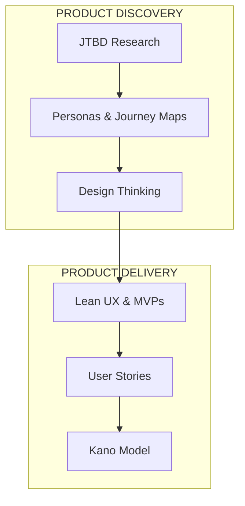

# Product Design Methodologies

Product design methodologies help teams understand user needs, define problems, and create solutions that deliver real value. This documentation covers the essential frameworks used by product teams worldwide.

## Overview

| Methodology | Purpose | When to Use |
|-------------|---------|-------------|
| [Jobs to Be Done](./explanation/jobs-to-be-done.md) | Understand user motivation | Product innovation, positioning |
| [User Stories](./explanation/user-stories.md) | Capture requirements | Agile development, backlog management |
| [User Journeys](./explanation/user-journeys.md) | Map user experience | CX improvement, alignment |
| [Personas](./explanation/personas.md) | Build user empathy | Design guidance, communication |
| [Design Thinking](./explanation/design-thinking.md) | Solve complex problems | Innovation, new products |
| [Lean UX](./explanation/lean-ux.md) | Iterate rapidly | Startups, validation |

## Start Here

**New to product design?**
→ Start with [Jobs to Be Done](./explanation/jobs-to-be-done.md) - the foundation of user-centered design

**Need to apply a methodology?**
→ Jump to [How-to: Conduct a JTBD Interview](./how-to/conduct-jtbd-interview.md)

**Want to understand the theory?**
→ Read [User Stories](./explanation/user-stories.md) or [Personas](./explanation/personas.md)

**Looking for templates or specs?**
→ Check [Templates](./reference/templates.md)

## The Big Picture



## Quick Reference

### Jobs to Be Done (JTBD)
> "Customers don't buy products—they hire them to make progress."

**Job Statement Format:**
```
When [situation], I want to [motivation], so I can [outcome].
```

[Learn more →](./explanation/jobs-to-be-done.md)

### User Stories
> "Focus on value delivered, not features built."

**Story Format:**
```
As a [user type], I want [goal], so that [benefit].
```

[Learn more →](./explanation/user-stories.md)

### Design Thinking
> "Empathize → Define → Ideate → Prototype → Test"

[Learn more →](./explanation/design-thinking.md)
