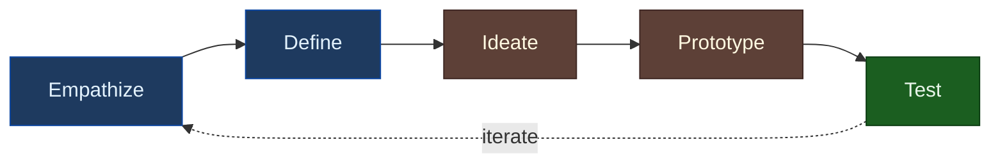
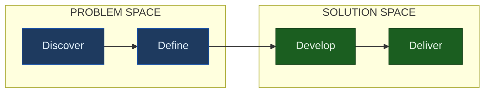

# Design Thinking

> "Design thinking is a human-centered approach to innovation that draws from the designer's toolkit to integrate the needs of people, the possibilities of technology, and the requirements for business success." — Tim Brown, IDEO

## Overview

Design thinking is a methodology for creative problem-solving that prioritizes understanding users deeply before jumping to solutions. It encourages iteration, prototyping, and embracing failure as a learning tool.

**Key insight**: Design thinking treats problems as opportunities for innovation, not just issues to fix. It systematically builds empathy before ideation.

## The IDEO 5-Phase Model

The most widely used design thinking framework comes from Stanford d.school and IDEO:



| Phase | Goal | Key Activities |
|-------|------|----------------|
| **Empathize** | Understand users deeply | Interviews, observation, immersion |
| **Define** | Frame the right problem | Synthesize insights, create POV statement |
| **Ideate** | Generate many solutions | Brainstorming, sketching, "How Might We" |
| **Prototype** | Make ideas tangible | Quick, cheap, testable artifacts |
| **Test** | Learn from users | Get feedback, iterate, refine |

## The Double Diamond

The British Design Council's Double Diamond visualizes divergent and convergent thinking:



| Phase | Mode | Activity |
|-------|------|----------|
| **Discover** | Divergent | Explore the problem space broadly |
| **Define** | Convergent | Focus on the specific problem to solve |
| **Develop** | Divergent | Generate many possible solutions |
| **Deliver** | Convergent | Refine and implement the solution |

**Key principle**: You must diverge (explore widely) before you converge (focus narrowly). Jumping to solutions skips the divergent phase where breakthrough insights emerge.

## Empathize Phase

Empathy is the foundation. Without deep user understanding, you're guessing.

### Techniques

| Technique | Description | Best For |
|-----------|-------------|----------|
| **Interviews** | 1:1 conversations about experiences | Deep individual insights |
| **Observation** | Watch users in their environment | Behaviors people can't articulate |
| **Immersion** | Experience the user's context yourself | Physical/environmental understanding |
| **Journey mapping** | Visualize the full experience | Identifying pain points |
| **Empathy mapping** | Capture what users say/think/feel/do | Synthesizing interview data |

### Empathy Map

| Quadrant | Questions |
|----------|-----------|
| **SAYS** | "I wish I could...", "The hardest part is..." |
| **THINKS** | Worries about..., Hopes for... |
| **DOES** | Checks phone often, Works around... |
| **FEELS** | Frustrated when..., Delighted by... |

## Define Phase

Synthesis transforms research into actionable problem statements.

### Point of View (POV) Statement

```
[USER] needs [NEED] because [INSIGHT].
```

**Example:**
> "Time-strapped managers need to spot team blockers quickly because delayed intervention leads to cascading delays."

### How Might We (HMW) Questions

Transform POV statements into design challenges:

| POV Insight | HMW Question |
|-------------|--------------|
| Managers don't see blockers early | How might we surface blockers automatically? |
| Status meetings waste time | How might we make status visible without meetings? |
| Context switching hurts productivity | How might we batch related information? |

**HMW sweet spot**: Broad enough to encourage creative solutions, narrow enough to be actionable.

## Ideate Phase

Generate quantity before quality. Defer judgment.

### Brainstorming Rules

1. **Defer judgment** — No criticism during ideation
2. **Encourage wild ideas** — They often lead to practical breakthroughs
3. **Build on others' ideas** — "Yes, and..." not "No, but..."
4. **Stay focused** — One conversation at a time
5. **Be visual** — Sketch, diagram, prototype
6. **Go for quantity** — More ideas = better ideas

### Techniques

| Technique | Description |
|-----------|-------------|
| **Brainstorming** | Classic group idea generation |
| **Brainwriting** | Silent individual ideation, then share |
| **Worst possible idea** | Generate terrible ideas (frees creative thinking) |
| **SCAMPER** | Substitute, Combine, Adapt, Modify, Put to other uses, Eliminate, Reverse |
| **Analogous inspiration** | How do other industries solve similar problems? |

## Prototype Phase

Prototypes make ideas tangible and testable. Start rough.

### Prototype Fidelity

| Fidelity | Effort | Best For |
|----------|--------|----------|
| **Paper sketch** | Minutes | Testing concepts, flows |
| **Clickable wireframe** | Hours | Testing navigation, structure |
| **Visual mockup** | Days | Testing visual design, tone |
| **Interactive prototype** | Days-weeks | Testing detailed interactions |
| **Functional MVP** | Weeks | Testing with real data, integration |

**Rule of thumb**: Use the lowest fidelity that can answer your question.

### Rapid Prototyping Principles

- **Fast over perfect** — Spend hours, not weeks
- **Disposable** — Don't get attached
- **Just enough** — Only build what you're testing
- **Specific** — Test one hypothesis at a time

## Test Phase

Testing validates (or invalidates) your assumptions.

### Testing Approaches

| Approach | What You Learn |
|----------|----------------|
| **Think-aloud usability** | Where users struggle, why |
| **A/B testing** | Which option performs better (quantitative) |
| **Wizard of Oz** | Test concept before building backend |
| **Concierge testing** | Manual version before automation |
| **Landing page test** | Demand validation before building |

### Feedback Interpretation

| User Says | Might Mean |
|-----------|------------|
| "I don't understand this" | Confusing language, unclear hierarchy |
| "Where do I click?" | Poor affordances, weak visual hierarchy |
| "Would I use this?" | Skepticism about value proposition |
| "I love it!" | Politeness (dig deeper for real feedback) |

## Design Thinking and AI Agents

For AI agents designing interfaces, design thinking provides:

| Phase | Agent Application |
|-------|-------------------|
| **Empathize** | Use provided personas, user stories, context |
| **Define** | Clarify the core problem before designing |
| **Ideate** | Generate multiple approaches, not just one |
| **Prototype** | Start with structure before polish |
| **Test** | Anticipate usability issues proactively |

**Key principle for agents**: Ask clarifying questions (empathize/define) before generating solutions (ideate/prototype).

## Common Pitfalls

| Pitfall | Problem | Fix |
|---------|---------|-----|
| **Solution jumping** | Skipping empathy phase | Mandate user research first |
| **Single idea** | Converging too early | Generate 10+ ideas before choosing |
| **Precious prototypes** | Over-investing before testing | Time-box prototyping |
| **Confirmation bias** | Only hearing positive feedback | Ask "what would make you not use this?" |
| **Waterfall disguise** | Linear process, no iteration | Build in explicit iteration loops |

## Related Reading

- [Lean UX](./lean-ux.md) — Design thinking applied to product teams
- [User Journeys](./user-journeys.md) — Empathy mapping technique
- [Personas](./personas.md) — Defining who you're designing for

## References

- Tim Brown, "Change by Design" (2009)
- IDEO, "The Field Guide to Human-Centered Design" (2015)
- Jake Knapp, "Sprint" (2016)
