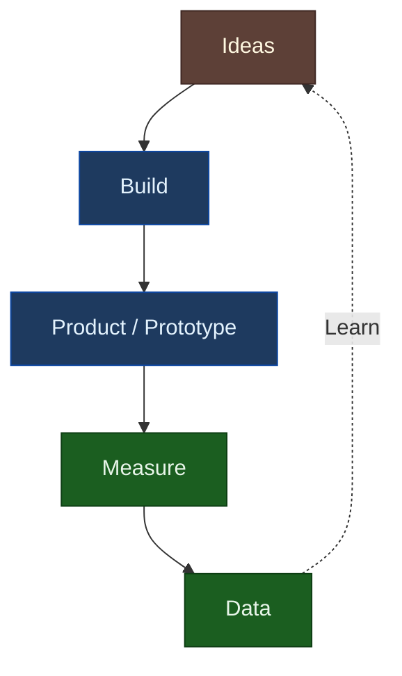

# Lean UX

> "Lean UX is the practice of bringing the true nature of our work to light faster, with less emphasis on deliverables and more emphasis on the actual experience being designed." — Jeff Gothelf

## Overview

Lean UX applies lean startup principles to user experience design. Instead of extensive upfront design documentation, Lean UX emphasizes rapid experimentation, cross-functional collaboration, and learning through iteration.

**Key insight**: Traditional UX produces deliverables. Lean UX produces outcomes. The measure of success shifts from "did we ship the design" to "did user behavior change."

## Core Principles

| Principle | Traditional UX | Lean UX |
|-----------|---------------|---------|
| **Deliverables** | Comprehensive specs | Minimum viable documentation |
| **Process** | Sequential phases | Continuous cycles |
| **Validation** | After build | Before and during build |
| **Collaboration** | Handoffs between roles | Cross-functional teams |
| **Success metric** | Shipped design | Changed behavior |

## The Build-Measure-Learn Loop



**Goal**: Minimize the time through the loop. Learn faster by building less.

## Hypothesis-Driven Design

Instead of requirements, Lean UX uses hypotheses:

### Hypothesis Format

```
We believe [this capability]
Will result in [this outcome]
We will have confidence to proceed when [we see this measurable signal]
```

### Example

```
We believe adding a progress indicator to the checkout flow
Will result in reduced cart abandonment
We will have confidence to proceed when we see a 10% reduction in exits from payment page
```

### Hypothesis Components

| Component | Purpose | Example |
|-----------|---------|---------|
| **Belief** | What you think is true | "Users abandon because of uncertainty" |
| **Capability** | What you'll build/change | "Progress indicator" |
| **Outcome** | Expected behavior change | "Reduced abandonment" |
| **Signal** | How you'll measure | "10% reduction in payment exits" |

## Minimum Viable Product (MVP)

An MVP is the smallest thing you can build to test a hypothesis.

### MVP Types

| Type | Effort | Tests |
|------|--------|-------|
| **Landing page** | Hours | Demand (do people want this?) |
| **Concierge** | Days | Value (does this solve the problem manually?) |
| **Wizard of Oz** | Days | UX (does the interface work, fake backend) |
| **Prototype** | Days-weeks | Usability (can people use it?) |
| **Feature flag** | Days-weeks | Value (does the real thing work?) |

### MVP Mindset

| Question | MVP Thinking |
|----------|--------------|
| What features? | What's the minimum to test the hypothesis? |
| How polished? | Just enough to not bias the test |
| How long? | Days, not weeks |
| What if it fails? | Great, we learned something cheaply |

## Collaborative Design

Lean UX breaks down role silos:

### Design Studio Method

A collaborative design session format:

1. **Problem presentation** (5 min) — Frame the challenge
2. **Individual sketching** (10 min) — Everyone sketches 6-8 ideas
3. **Pitch & critique** (3 min each) — Present ideas, get feedback
4. **Iterate** (5 min) — Revise based on feedback
5. **Team sketch** (10 min) — Converge on best elements

**Participants**: Designer, developer, PM, anyone relevant. Diverse perspectives > design expertise.

### Continuous Collaboration

| Traditional | Lean UX |
|-------------|---------|
| Designer creates, hands off | Team creates together |
| Weekly design reviews | Daily collaboration |
| Documentation for alignment | Conversation for alignment |
| "Here's the spec" | "Let's figure this out" |

## Outcome-Focused Metrics

Lean UX measures outcomes, not outputs:

| Output (Traditional) | Outcome (Lean UX) |
|---------------------|-------------------|
| Shipped the feature | User behavior changed |
| Delivered wireframes | Team has shared understanding |
| Completed user research | Actionable insights gained |
| Published style guide | Consistent user experience |

### Leading vs Lagging Indicators

| Type | Timeframe | Example |
|------|-----------|---------|
| **Lagging** | Results (weeks-months) | Revenue, NPS, retention |
| **Leading** | Predictive (days-weeks) | Feature adoption, task completion rate |

**Focus on leading indicators** — they give faster feedback loops.

## Experiment Design

### Experiment Canvas

```
┌──────────────────────────────────────────────────────────────┐
│ HYPOTHESIS                                                    │
│ We believe [capability] will result in [outcome]             │
├──────────────────────────────────────────────────────────────┤
│ EXPERIMENT                                                    │
│ To verify, we will [experiment description]                  │
├───────────────────────────────┬──────────────────────────────┤
│ SUCCESS CRITERIA              │ FAILURE CRITERIA             │
│ We are right if [metric]      │ We are wrong if [metric]     │
├───────────────────────────────┼──────────────────────────────┤
│ WHAT WE'LL BUILD              │ WHAT WE'LL MEASURE           │
│ - [minimal artifact]          │ - [specific metric]          │
│ - [test approach]             │ - [observation method]       │
├───────────────────────────────┴──────────────────────────────┤
│ TIMELINE: [days/weeks] │ TEAM: [who's involved]              │
└──────────────────────────────────────────────────────────────┘
```

### Experiment Types

| Type | Best For | Timeframe |
|------|----------|-----------|
| **Usability test** | Interaction design validation | Days |
| **A/B test** | Comparing options quantitatively | Weeks |
| **Fake door** | Demand validation for new features | Days |
| **Smoke test** | Testing value proposition | Days |
| **Cohort analysis** | Long-term behavior change | Months |

## Lean UX and AI Agents

For AI agents designing interfaces:

| Lean UX Concept | Agent Application |
|-----------------|-------------------|
| **Hypothesis thinking** | Frame design decisions as testable assumptions |
| **MVP approach** | Create minimal viable UI, iterate based on feedback |
| **Outcome focus** | Design for user behavior change, not feature completion |
| **Experiment mindset** | Anticipate what would validate/invalidate design choices |

**Key principle for agents**: When uncertain, propose the simplest solution that could work and suggest how to validate it.

## Common Pitfalls

| Pitfall | Problem | Fix |
|---------|---------|-----|
| **Fake Lean** | Calling waterfall process "agile" | Actually build small, measure, iterate |
| **Data worship** | Only valuing quantitative metrics | Balance with qualitative research |
| **MVP as excuse** | Shipping crap and calling it "lean" | MVP is still high quality for what it does |
| **Collaboration theater** | Meetings without real collaboration | Use structured methods like Design Studio |
| **Perpetual beta** | Never declaring anything "done" | Define when to move from learning to scaling |

## Lean UX in Practice

### Weekly Rhythm

| Day | Activity |
|-----|----------|
| **Monday** | Review learnings from last week, update hypotheses |
| **Tuesday-Wednesday** | Build experiments/prototypes |
| **Thursday** | User testing, data review |
| **Friday** | Synthesize learnings, plan next experiments |

### Documentation

Keep documentation minimal and current:

| Document | Lean UX Version |
|----------|-----------------|
| PRD | Hypothesis canvas (1 page) |
| Wireframes | Sketches, photos of whiteboard |
| Specs | Working prototype |
| Research report | Key insights posted in team channel |

## Related Reading

- [Design Thinking](./design-thinking.md) — The foundation Lean UX builds on
- [Jobs to Be Done](./jobs-to-be-done.md) — Understanding what outcomes users want
- [User Stories](./user-stories.md) — Lightweight requirements for hypotheses

## References

- Jeff Gothelf & Josh Seiden, "Lean UX" (2013, 3rd ed. 2021)
- Eric Ries, "The Lean Startup" (2011)
- Marty Cagan, "Inspired" (2008, 2nd ed. 2017)
