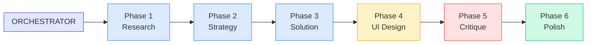
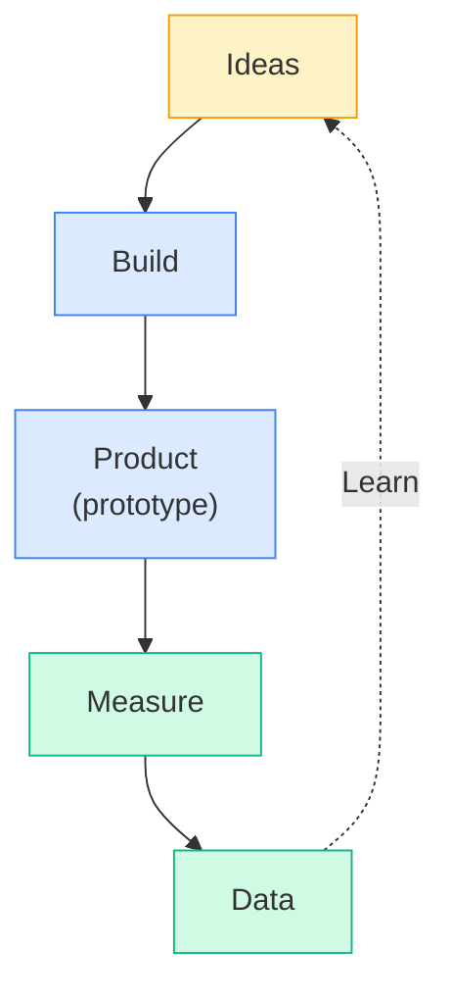
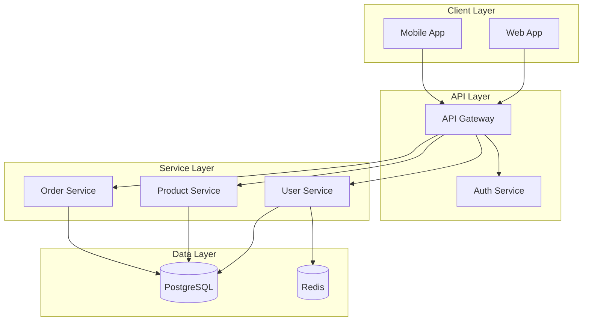
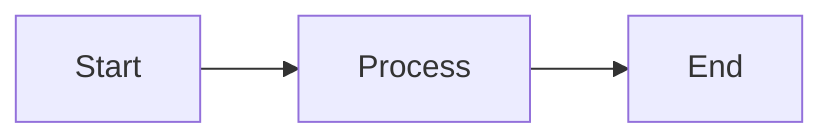
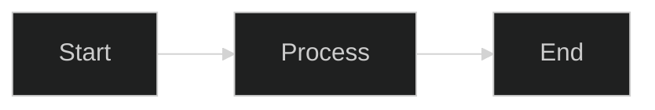
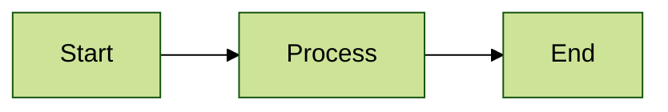
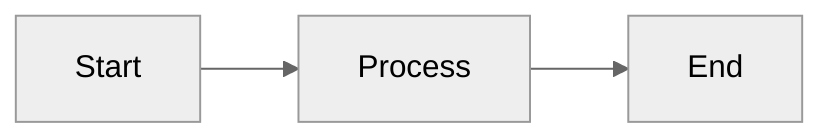
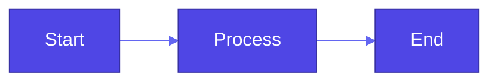

# Diagram Tools Comparison

This page demonstrates different diagram rendering options available in this documentation.

## Quick Comparison

| Tool | Strengths | Best For |
|------|-----------|----------|
| **Mermaid** | Built-in, simple syntax, GitHub compatible | Quick diagrams, flowcharts |
| **D2** | Professional output, unified syntax, sketch mode | Architecture, polished docs |
| **Kroki** | 24+ diagram types via one API | Specialized diagrams (future) |

---

## Example: Agent Workflow

### Mermaid Version



### D2 Version

```d2
direction: right

orchestrator: ORCHESTRATOR

p1: Phase 1\nResearch
p2: Phase 2\nStrategy
p3: Phase 3\nSolution
p4: Phase 4\nUI Design
p5: Phase 5\nCritique
p6: Phase 6\nPolish

orchestrator -> p1
p1 -> p2 -> p3 -> p4 -> p5 -> p6
```

---

## Example: Build-Measure-Learn Loop

### Mermaid Version



### D2 Version

```d2
direction: down

ideas: Ideas
build: Build
product: Product\n(prototype)
measure: Measure
data: Data

ideas -> build -> product -> measure -> data
data -> ideas: Learn {
  style.stroke-dash: 5
}
```

---

## Example: Architecture Diagram

### Mermaid Version



### D2 Version

```d2
direction: down

client: Client Layer {
  web: Web App
  mobile: Mobile App
}

api: API Layer {
  gateway: API Gateway
  auth: Auth Service
}

services: Service Layer {
  users: User Service
  products: Product Service
  orders: Order Service
}

data: Data Layer {
  db: PostgreSQL {
    shape: cylinder
  }
  cache: Redis {
    shape: cylinder
  }
}

client.web -> api.gateway
client.mobile -> api.gateway
api.gateway -> api.auth
api.gateway -> services.users
api.gateway -> services.products
api.gateway -> services.orders
services.users -> data.db
services.products -> data.db
services.orders -> data.db
services.users -> data.cache
```

---

## Example: D2 Sketch Mode

D2 supports a hand-drawn "sketch" mode for a more informal feel:

```d2
# This would render in sketch mode if configured

user: User {
  shape: person
}

app: Application {
  ui: Frontend
  api: Backend API
  db: Database {
    shape: cylinder
  }
}

user -> app.ui: Uses
app.ui -> app.api: REST calls
app.api -> app.db: Queries
```

---

## Mermaid Theming Options

### Default Theme


### Dark Theme


### Forest Theme


### Neutral Theme


### Custom Theme Variables



---

## Recommendations

### Use Mermaid When:
- Quick diagrams needed
- GitHub README compatibility required
- Simple flowcharts or sequence diagrams
- Built-in theme integration is sufficient

### Use D2 When:
- Professional/polished output needed
- Complex architecture diagrams
- Consistent styling across many diagrams
- Hand-drawn sketch style desired

---

## Future: Kroki Integration

Kroki provides a unified API for 24+ diagram types. See [Kroki Setup Guide](./kroki-setup.md) for future integration instructions.

Supported diagram types include:
- BlockDiag, SeqDiag, ActDiag, NwDiag
- PlantUML (all UML types)
- C4 architecture diagrams
- Graphviz/DOT
- Mermaid
- D2
- Excalidraw
- And many more...
