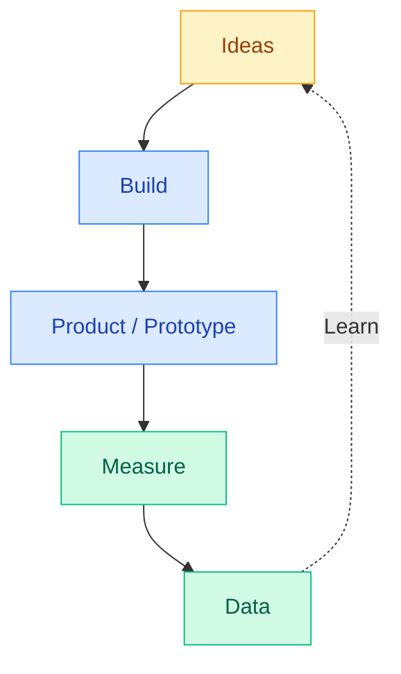
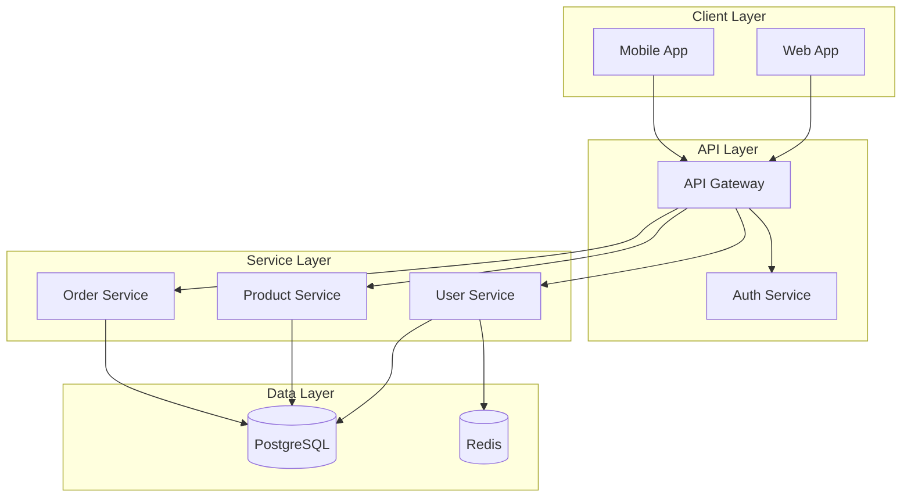
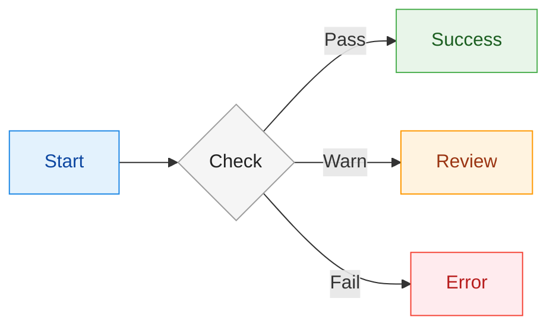
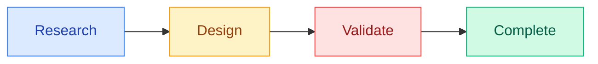

```mermaid
flowchart LR
    classDef orchestrator fill:#E0E7FF,stroke:#4F46E5,color:#3730A3
    classDef research fill:#DBEAFE,stroke:#3B82F6,color:#1E40AF
    classDef design fill:#FEF3C7,stroke:#F59E0B,color:#92400E
    classDef validate fill:#FEE2E2,stroke:#EF4444,color:#991B1B
    classDef complete fill:#D1FAE5,stroke:#10B981,color:#065F46
    
    subgraph Orchestrator["ORCHESTRATOR"]
        direction LR
    end
    
    P1[Phase 1: Research]:::research --> P2[Phase 2: Strategy]:::research
    P2 --> P3[Phase 3: Solution]:::research
    P3 --> P4[Phase 4: UI Design]:::design
    P4 --> P5[Phase 5: Critique]:::validate
    P5 --> P6[Phase 6: Polish]:::complete
    
    Orchestrator:::orchestrator --> P1
```

# Diagram Tools Comparison

This page demonstrates different diagram rendering options available in this documentation.

## Quick Comparison

| Tool | Strengths | Best For |
|------|-----------|----------|
| **Mermaid** | Built-in, simple syntax, GitHub compatible | Quick diagrams, flowcharts |
| **D2** | Professional output, unified syntax, sketch mode | Architecture, polished docs |
| **Kroki** | 24+ diagram types via one API | Specialized diagrams (future) |

---

## Example: Agent Workflow

### Mermaid Version



### D2 Version

```d2
direction: right

# Define semantic style classes
classes: {
  orchestrator: {
    style: {
      fill: "#E0E7FF"
      stroke: "#4F46E5"
      font-color: "#3730A3"
    }
  }
  research: {
    style: {
      fill: "#DBEAFE"
      stroke: "#3B82F6"
      font-color: "#1E40AF"
    }
  }
  design: {
    style: {
      fill: "#FEF3C7"
      stroke: "#F59E0B"
      font-color: "#92400E"
    }
  }
  validate: {
    style: {
      fill: "#FEE2E2"
      stroke: "#EF4444"
      font-color: "#991B1B"
    }
  }
  complete: {
    style: {
      fill: "#D1FAE5"
      stroke: "#10B981"
      font-color: "#065F46"
    }
  }
}

orchestrator: ORCHESTRATOR {
  class: orchestrator
}

p1: |md
  **Phase 1**
  Research
| {
  class: research
}
p2: |md
  **Phase 2**
  Strategy
| {
  class: research
}
p3: |md
  **Phase 3**
  Solution
| {
  class: research
}
p4: |md
  **Phase 4**
  UI Design
| {
  class: design
}
p5: |md
  **Phase 5**
  Critique
| {
  class: validate
}
p6: |md
  **Phase 6**
  Polish
| {
  class: complete
}

orchestrator -> p1
p1 -> p2 -> p3 -> p4 -> p5 -> p6
```

---

## Example: Build-Measure-Learn Loop

### Mermaid Version



### D2 Version

```d2
direction: down

classes: {
  ideate: {
    style: {
      fill: "#FEF3C7"
      stroke: "#F59E0B"
      font-color: "#92400E"
    }
  }
  build: {
    style: {
      fill: "#DBEAFE"
      stroke: "#3B82F6"
      font-color: "#1E40AF"
    }
  }
  measure: {
    style: {
      fill: "#D1FAE5"
      stroke: "#10B981"
      font-color: "#065F46"
    }
  }
}

ideas: Ideas { class: ideate }
build: Build { class: build }
product: |md
  **Product**
  (prototype)
| { class: build }
measure: Measure { class: measure }
data: Data { class: measure }

ideas -> build -> product -> measure -> data
data -> ideas: Learn {
  style.stroke-dash: 5
}
```

---

## Example: Architecture Diagram

### Mermaid Version



### D2 Version

```d2
direction: down

classes: {
  client-layer: {
    style: {
      fill: "#DBEAFE"
      stroke: "#3B82F6"
      font-color: "#1E40AF"
    }
  }
  api-layer: {
    style: {
      fill: "#E0E7FF"
      stroke: "#4F46E5"
      font-color: "#3730A3"
    }
  }
  service-layer: {
    style: {
      fill: "#FEF3C7"
      stroke: "#F59E0B"
      font-color: "#92400E"
    }
  }
  data-layer: {
    style: {
      fill: "#D1FAE5"
      stroke: "#10B981"
      font-color: "#065F46"
    }
  }
}

client: Client Layer {
  class: client-layer
  web: Web App
  mobile: Mobile App
}

api: API Layer {
  class: api-layer
  gateway: API Gateway
  auth: Auth Service
}

services: Service Layer {
  class: service-layer
  users: User Service
  products: Product Service
  orders: Order Service
}

data: Data Layer {
  class: data-layer
  db: PostgreSQL {
    shape: cylinder
  }
  cache: Redis {
    shape: cylinder
  }
}

client.web -> api.gateway
client.mobile -> api.gateway
api.gateway -> api.auth
api.gateway -> services.users
api.gateway -> services.products
api.gateway -> services.orders
services.users -> data.db
services.products -> data.db
services.orders -> data.db
services.users -> data.cache
```

---

## Example: D2 Sketch Mode

D2 supports a hand-drawn "sketch" mode for a more informal feel:

```d2
# This would render in sketch mode if configured

classes: {
  user-class: {
    style: {
      fill: "#DBEAFE"
      stroke: "#3B82F6"
      font-color: "#1E40AF"
    }
  }
  app-class: {
    style: {
      fill: "#F5F5F5"
      stroke: "#9E9E9E"
      font-color: "#212121"
    }
  }
}

user: User {
  shape: person
  class: user-class
}

app: Application {
  class: app-class
  ui: Frontend
  api: Backend API
  db: Database {
    shape: cylinder
  }
}

user -> app.ui: Uses
app.ui -> app.api: REST calls
app.api -> app.db: Queries
```

---

## Mermaid Styling Patterns

### Using classDef (Recommended)

Define reusable style classes for semantic meaning:



### Workflow Phases Example



### Built-in Themes

MkDocs Material automatically handles light/dark mode. For reference, Mermaid's built-in themes:

| Theme | Best For |
|-------|----------|
| `default` | Standard light documentation |
| `dark` | Dark mode interfaces |
| `neutral` | Print/black-white |
| `forest` | Green-themed |
| `base` | Custom styling only |

---

## Recommendations

### Use Mermaid When:
- Quick diagrams needed
- GitHub README compatibility required
- Simple flowcharts or sequence diagrams
- Built-in theme integration is sufficient

### Use D2 When:
- Professional/polished output needed
- Complex architecture diagrams
- Consistent styling across many diagrams
- Hand-drawn sketch style desired

---

## Future: Kroki Integration

Kroki provides a unified API for 24+ diagram types. See [Kroki Setup Guide](./kroki-setup.md) for future integration instructions.

Supported diagram types include:
- BlockDiag, SeqDiag, ActDiag, NwDiag
- PlantUML (all UML types)
- C4 architecture diagrams
- Graphviz/DOT
- Mermaid
- D2
- Excalidraw
- And many more...
