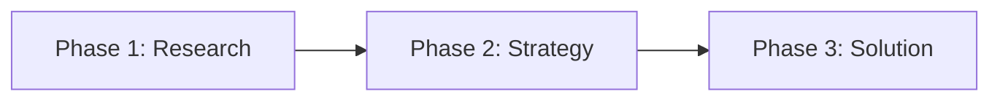
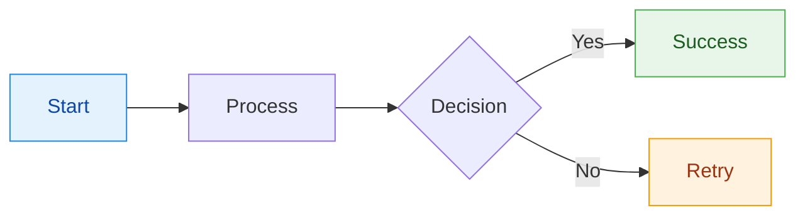

# Diagram Style Guide

This guide documents conventions for creating diagrams in this documentation. Following these patterns ensures consistency, maintainability, and proper rendering across light/dark modes.

## Quick Reference

| Aspect | Mermaid | D2 |
|--------|---------|-----|
| **Multi-line labels** | Avoid (use single-line) | Use block strings (`\|md ... \|`) |
| **Styling** | Use `classDef` | Use themes (avoid inline styles) |
| **Themes** | Let MkDocs Material handle | `theme: 0`, `dark_theme: 200` |
| **Best for** | Quick diagrams, GitHub compat | Architecture, polished output |

---

## Mermaid Conventions

### Label Formatting

**Do:** Use simple, single-line labels



**Don't:** Use `<br/>`, `\n`, or HTML tags (they get escaped in MkDocs)

```mermaid
# AVOID - HTML gets escaped
A["Phase 1<br/>Research"] --> B["Phase 2<br/>Strategy"]
```

### Styling with classDef

Define reusable style classes instead of inline styles:



### Recommended Class Definitions

```mermaid
flowchart LR
    %% Semantic color classes
    classDef primary fill:#E3F2FD,stroke:#1E88E5,color:#0D47A1
    classDef secondary fill:#F5F5F5,stroke:#9E9E9E,color:#212121
    classDef success fill:#E8F5E9,stroke:#4CAF50,color:#1B5E20
    classDef warning fill:#FFF3E0,stroke:#FF9800,color:#9A3412
    classDef error fill:#FFEBEE,stroke:#F44336,color:#B71C1C
    classDef info fill:#E1F5FE,stroke:#03A9F4,color:#01579B
```

### Theme Configuration

Let MkDocs Material handle theming automatically. Avoid setting explicit themes unless needed:


### Anti-Patterns to Avoid

1. **Lowercase `end`** - Use `End` or `END`
2. **Leading `o` or `x`** - Add space: `A --- onboarding`
3. **Inline styles** - Use `classDef` instead
4. **Hardcoded colors** - Use semantic class names
5. **Over-complex diagrams** - Break into smaller focused diagrams

---

## D2 Conventions

### Label Formatting

**Do:** Use block strings with markdown for multi-line labels

```d2
node: |md
  **Title**
  Description text
|
```

**Don't:** Use `\n` escape sequences

```d2
# AVOID
node: Title\nDescription
```

### Container Structure

Use containers to group related elements:

```d2
direction: down

frontend: Frontend {
  web: Web App
  mobile: Mobile App
}

backend: Backend {
  api: API Server
  db: Database {
    shape: cylinder
  }
}

frontend.web -> backend.api
frontend.mobile -> backend.api
backend.api -> backend.db
```

### Styling

**Prefer themes over inline styles.** Our configuration:

- Light mode: `theme: 0` (Neutral Default)
- Dark mode: `dark_theme: 200` (Dark Mauve)

When inline styles are needed, use sparingly:

```d2
# Only for special emphasis
critical: Critical Path {
  style: {
    stroke: "#D32F2F"
    stroke-width: 3
  }
}
```

### Layout Engine

We use **ELK** (`layout: elk`) for:

- Better handling of complex hierarchies
- More professional appearance
- Consistent spacing

### Special Shapes

```d2
# Use semantic shapes
user: User {
  shape: person
}

database: Storage {
  shape: cylinder
}

cloud: Cloud Service {
  shape: cloud
}

process: Background Job {
  shape: hexagon
}
```

### Connection Styles

```d2
# Solid connection (default)
a -> b

# Dashed connection
a -> b: {
  style.stroke-dash: 5
}

# Animated connection
a -> b: {
  style.animated: true
}

# Bidirectional
a <-> b

# Multiple labels
a -> b: label1
a -> b: label2
```

---

## When to Use Which Tool

### Use Mermaid For:

- Simple flowcharts
- Sequence diagrams
- Quick documentation diagrams
- GitHub README compatibility
- Diagrams that need to work without plugins

### Use D2 For:

- Architecture diagrams
- Complex system overviews
- Professional/publication-ready output
- Diagrams with containers/grouping
- When you need sketch mode

---

## File Organization

```
docs/
├── reference/
│   ├── diagram-comparison.md    # Tool comparison
│   └── diagram-style-guide.md   # This file
└── **/*.md                      # Inline diagrams in docs
```

For complex diagrams that are reused, consider:

1. Creating standalone `.d2` files
2. Using the image tag syntax: ``

---

## Accessibility Considerations

1. **Color contrast** - Ensure 4.5:1 ratio for text
2. **Don't rely on color alone** - Use shapes, labels, patterns
3. **Alt text** - Provide context in surrounding prose
4. **Keep it simple** - Complex diagrams are harder for screen readers

---

## Configuration Reference

### mkdocs.yml D2 Settings

```yaml
plugins:
  - d2:
      executable: /path/to/d2
      layout: elk           # dagre, elk, or tala
      theme: 0              # Light theme (0-17)
      dark_theme: 200       # Dark theme (200-201)
      sketch: false         # Hand-drawn style
      pad: 100              # Padding around diagram
      scale: 0.8            # Scale factor
```

### Available D2 Themes

**Light themes:** 0 (Neutral Default), 1-17 (various styles)
**Dark themes:** 200 (Dark Mauve), 201 (Dark Flagship)

See [D2 Themes](https://d2lang.com/tour/themes/) for full catalog.
