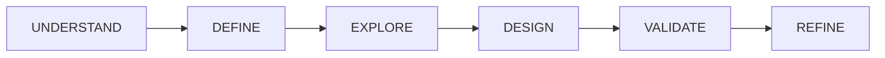

# UI Creation Workflow

A systematic, agent-based approach to creating user interfaces that starts with understanding users and ends with validated, accessible designs.

## Philosophy

Traditional UI development often jumps straight to visual design. This workflow enforces a disciplined journey:

**Each phase has:**
- A specialized agent with focused expertise
- Clear inputs and outputs
- Validation gates before proceeding
- Artifacts that inform the next phase

## The Six Phases

| Phase | Agent | Focus | Output |
|-------|-------|-------|--------|
| 1. **Understand** | Research Agent | Who are the users? What do they need? | Personas, JTBD statements |
| 2. **Define** | Strategy Agent | What problem are we solving? | Problem statement, success metrics |
| 3. **Explore** | Solution Agent | How might we solve this? | Solution concepts, user flows |
| 4. **Design** | UI Agent | How do we express the solution? | Component architecture, layouts |
| 5. **Validate** | Critique Agent | Does this actually work? | Accessibility audit, heuristic review |
| 6. **Refine** | Polish Agent | How do we perfect the details? | Final implementation |

## Why This Matters for AI Agents

AI agents can generate UI quickly—but speed without direction produces generic, disconnected interfaces. This workflow ensures:

1. **Context-awareness** — Every design decision traces back to user needs
2. **Consistency** — Shared understanding across agent handoffs
3. **Quality gates** — Problems caught early, not in production
4. **Explainability** — Every choice has documented rationale

## Workflow Artifacts

Each phase produces artifacts that flow forward:

| Phase | Artifacts |
|-------|-----------|
| **UNDERSTAND** | Persona cards, JTBD statements, Context scenarios |
| **DEFINE** | Problem statement, Success metrics, Constraints & requirements |
| **EXPLORE** | Solution hypotheses, User flow diagrams, Information architecture |
| **DESIGN** | Component inventory, Layout specifications, Interaction patterns |
| **VALIDATE** | Accessibility audit, Heuristic evaluation, User flow verification |
| **REFINE** | Visual polish, Micro-interactions, Final implementation |

## Getting Started

### Phase Documentation
1. [Phase 1: Understanding Users](./phases/01-understand.md)
2. [Phase 2: Defining the Problem](./phases/02-define.md)
3. [Phase 3: Exploring Solutions](./phases/03-explore.md)
4. [Phase 4: Designing the Interface](./phases/04-design.md)
5. [Phase 5: Validating the Design](./phases/05-validate.md)
6. [Phase 6: Refining the Details](./phases/06-refine.md)

### Agentic Workflow Reference
- [Orchestrator Instructions](./orchestrator.md) — How to coordinate the workflow
- [Quality Gates Reference](./quality-gates.md) — Pass/fail criteria for each phase
- [Agent Prompts](./agent-prompts.md) — Detailed prompts for each specialized agent

## See It In Action

Walk through complete examples showing this workflow applied:

- [Dashboard Example](/story/dashboard) — Analytics dashboard for a SaaS product
- [Settings Example](/story/settings) — User preferences and account management
- [E-commerce Example](/story/ecommerce) — Product browsing and purchase flow
- [Data Table Example](/story/datatable) — Complex data management interface
