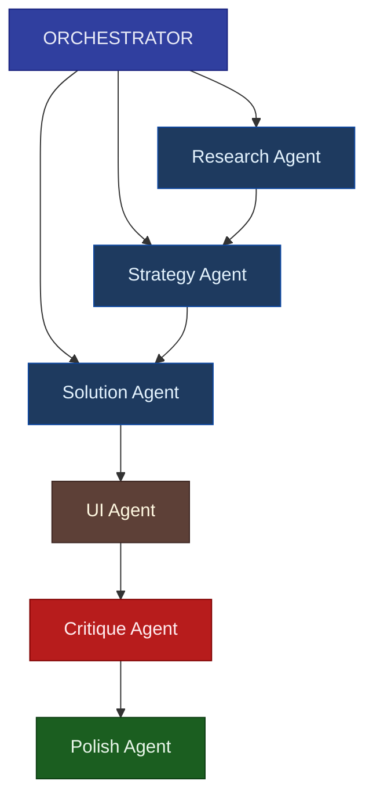

# Orchestrator Instructions

> Central coordinator for the 6-phase UI design workflow

## Role

The Orchestrator manages the end-to-end workflow, delegating to specialized agents, validating outputs, and ensuring quality gates pass before phase transitions.

## Architecture



## State Schema

```typescript
interface WorkflowState {
  // Project context
  projectBrief: string;
  constraints: Constraint[];
  
  // Phase completion flags
  phase1Complete: boolean;
  phase2Complete: boolean;
  phase3Complete: boolean;
  phase4Complete: boolean;
  phase5Complete: boolean;
  phase6Complete: boolean;
  
  // Phase artifacts
  artifacts: {
    personas: Persona[];
    jtbdStatements: JTBDStatement[];
    contextScenarios: Scenario[];
    problemStatement: string;
    successMetrics: Metric[];
    hmwQuestions: string[];
    solutionHypotheses: Solution[];
    userFlows: UserFlow[];
    informationArchitecture: InfoArch;
    componentSpecs: ComponentSpec[];
    layoutSpecs: LayoutSpec[];
    interactionPatterns: InteractionPattern[];
    accessibilityAudit: AuditResult;
    heuristicEvaluation: HeuristicResult;
    issueList: Issue[];
    microInteractions: MicroInteraction[];
    implementationGuide: ImplementationGuide;
  };
  
  // Quality tracking
  qualityGates: {
    phase: string;
    passed: boolean;
    failures: string[];
    timestamp: Date;
  }[];
  
  // Workflow metadata
  currentPhase: 1 | 2 | 3 | 4 | 5 | 6 | 'complete';
  iterationCount: number;
  rollbackHistory: RollbackEvent[];
}
```

## Routing Logic

```python
def route_to_next_phase(state: WorkflowState) -> str:
    """Determine next phase based on current state"""
    
    # Check if workflow complete
    if state.phase6Complete and all_quality_gates_passed(state):
        return "complete"
    
    # Phase transitions (only if quality gate passed)
    if not state.phase1Complete:
        return "research_agent"
    
    if not state.phase2Complete:
        if quality_gate_passed(state, "phase1"):
            return "strategy_agent"
        else:
            return "research_agent"  # Retry
    
    if not state.phase3Complete:
        if quality_gate_passed(state, "phase2"):
            return "solution_agent"
        else:
            return "strategy_agent"  # Retry
    
    if not state.phase4Complete:
        if quality_gate_passed(state, "phase3"):
            return "ui_agent"
        else:
            return "solution_agent"  # Retry
    
    if not state.phase5Complete:
        if quality_gate_passed(state, "phase4"):
            return "critique_agent"
        else:
            return "ui_agent"  # Retry
    
    if not state.phase6Complete:
        if quality_gate_passed(state, "phase5"):
            return "polish_agent"
        else:
            return "critique_agent"  # Retry
    
    return "complete"
```

## Quality Gate Validation

Each phase transition requires passing a quality gate:

```python
def validate_quality_gate(state: WorkflowState, phase: str) -> QualityGateResult:
    """Validate phase output meets requirements"""
    
    failures = []
    
    if phase == "phase1":
        # Research Agent outputs
        if len(state.artifacts.personas) < 2:
            failures.append("FAIL: Need at least 2 personas")
        if len(state.artifacts.jtbdStatements) < 3:
            failures.append("FAIL: Need at least 3 JTBD statements")
        if len(state.artifacts.contextScenarios) < 2:
            failures.append("FAIL: Need at least 2 context scenarios")
        for jtbd in state.artifacts.jtbdStatements:
            if not jtbd.matches_format("When..., I want to..., So I can..."):
                failures.append(f"FAIL: JTBD not in correct format: {jtbd}")
    
    elif phase == "phase2":
        # Strategy Agent outputs
        if not state.artifacts.problemStatement:
            failures.append("FAIL: Missing problem statement")
        if len(state.artifacts.successMetrics) < 3:
            failures.append("FAIL: Need at least 3 success metrics")
        if len(state.artifacts.hmwQuestions) < 5:
            failures.append("FAIL: Need at least 5 HMW questions")
        for metric in state.artifacts.successMetrics:
            if not metric.is_measurable():
                failures.append(f"FAIL: Metric not measurable: {metric}")
    
    elif phase == "phase3":
        # Solution Agent outputs
        if len(state.artifacts.solutionHypotheses) < 3:
            failures.append("FAIL: Need at least 3 solution options explored")
        if len(state.artifacts.userFlows) < 1:
            failures.append("FAIL: Need at least 1 user flow")
        if not state.artifacts.informationArchitecture:
            failures.append("FAIL: Missing information architecture")
        if not any(s.selected for s in state.artifacts.solutionHypotheses):
            failures.append("FAIL: No solution selected with rationale")
    
    elif phase == "phase4":
        # UI Agent outputs
        if len(state.artifacts.componentSpecs) < 1:
            failures.append("FAIL: Missing component specifications")
        if len(state.artifacts.layoutSpecs) < 1:
            failures.append("FAIL: Missing layout specifications")
        for spec in state.artifacts.componentSpecs:
            if spec.uses_hardcoded_values():
                failures.append(f"FAIL: Hardcoded values found in {spec.name}")
        for spec in state.artifacts.layoutSpecs:
            if not spec.has_responsive_behavior():
                failures.append(f"FAIL: Missing responsive spec for {spec.name}")
    
    elif phase == "phase5":
        # Critique Agent outputs
        if not state.artifacts.accessibilityAudit:
            failures.append("FAIL: Missing accessibility audit")
        if not state.artifacts.heuristicEvaluation:
            failures.append("FAIL: Missing heuristic evaluation")
        critical_issues = [i for i in state.artifacts.issueList if i.severity == "critical"]
        if len(critical_issues) > 0:
            failures.append(f"FAIL: {len(critical_issues)} critical issues unresolved")
    
    elif phase == "phase6":
        # Polish Agent outputs
        major_issues = [i for i in state.artifacts.issueList if i.severity in ["critical", "major"] and not i.resolved]
        if len(major_issues) > 0:
            failures.append(f"FAIL: {len(major_issues)} major issues unresolved")
        if not state.artifacts.implementationGuide:
            failures.append("FAIL: Missing implementation guide")
    
    return QualityGateResult(
        passed=len(failures) == 0,
        failures=failures,
        phase=phase,
        timestamp=datetime.now()
    )
```

## Error Recovery

```python
MAX_RETRIES_PER_PHASE = 3

def handle_quality_gate_failure(state: WorkflowState, phase: str, failures: list[str]) -> Command:
    """Handle failed quality gate"""
    
    retry_count = count_retries(state, phase)
    
    if retry_count >= MAX_RETRIES_PER_PHASE:
        # Escalate to human
        return Command(
            action="escalate",
            reason=f"Phase {phase} failed {MAX_RETRIES_PER_PHASE} times",
            failures=failures,
            state_snapshot=state
        )
    
    # Provide specific feedback for retry
    feedback = generate_retry_feedback(failures)
    
    return Command(
        action="retry",
        phase=phase,
        feedback=feedback,
        retry_count=retry_count + 1
    )

def generate_retry_feedback(failures: list[str]) -> str:
    """Generate actionable feedback from failures"""
    return f"""
    QUALITY GATE FAILED. Please address:
    
    {chr(10).join(f'• {f}' for f in failures)}
    
    Revise your output to address these issues and resubmit.
    """
```

## Checkpointing

```python
def save_checkpoint(state: WorkflowState, phase: str) -> Checkpoint:
    """Save state before phase transition"""
    return Checkpoint(
        id=generate_checkpoint_id(),
        phase=phase,
        timestamp=datetime.now(),
        state=deep_copy(state),
        artifacts=deep_copy(state.artifacts)
    )

def restore_checkpoint(checkpoint_id: str) -> WorkflowState:
    """Restore state from checkpoint"""
    checkpoint = load_checkpoint(checkpoint_id)
    return checkpoint.state
```

## Orchestrator Prompt

```
You are the UI Design Workflow Orchestrator. You coordinate a 6-phase 
workflow to create user-centered interfaces.

WORKFLOW PHASES:
1. UNDERSTAND (Research Agent) → Personas, JTBD, Scenarios
2. DEFINE (Strategy Agent) → Problem statement, Metrics, HMW questions
3. EXPLORE (Solution Agent) → Solutions, User flows, IA
4. DESIGN (UI Agent) → Components, Layouts, Interactions
5. VALIDATE (Critique Agent) → Accessibility, Heuristics, Issues
6. REFINE (Polish Agent) → Fixes, Micro-interactions, Implementation

YOUR RESPONSIBILITIES:

1. PHASE MANAGEMENT
   - Track current phase and completion status
   - Route to appropriate agent based on state
   - Ensure artifacts flow forward correctly

2. QUALITY GATES
   - Validate each phase output before transition
   - Block transitions if quality gate fails
   - Provide specific feedback for failures

3. ERROR HANDLING
   - Retry failed phases (max 3 attempts)
   - Escalate to human after max retries
   - Maintain rollback capability

4. CONTEXT MANAGEMENT
   - Pass relevant context to each agent
   - Compress older artifacts to save tokens
   - Maintain traceability to user needs

DECISION RULES:

- NEVER skip a phase
- ALWAYS validate quality gate before proceeding
- ALWAYS provide previous phase artifacts as context
- ESCALATE if same phase fails 3 times
- CHECKPOINT before and after each phase

OUTPUT FORMAT:
{
  "current_phase": 1-6,
  "next_action": "invoke_agent" | "validate_gate" | "escalate" | "complete",
  "agent": "research" | "strategy" | "solution" | "ui" | "critique" | "polish",
  "context_for_agent": { ... },
  "quality_gate_result": { ... }
}
```

## Integration Example

```python
async def run_workflow(project_brief: str) -> WorkflowState:
    """Execute complete UI design workflow"""
    
    # Initialize state
    state = WorkflowState(
        projectBrief=project_brief,
        currentPhase=1
    )
    
    # Create orchestrator
    orchestrator = Orchestrator(model=llm)
    
    # Run until complete
    while state.currentPhase != "complete":
        # Save checkpoint
        checkpoint = save_checkpoint(state, f"phase{state.currentPhase}_start")
        
        # Route to next agent
        next_agent = route_to_next_phase(state)
        
        if next_agent == "complete":
            break
        
        # Invoke agent
        try:
            result = await invoke_agent(next_agent, state)
            state = update_state(state, result)
            
            # Validate quality gate
            gate_result = validate_quality_gate(state, f"phase{state.currentPhase}")
            
            if gate_result.passed:
                state.currentPhase += 1
                save_checkpoint(state, f"phase{state.currentPhase - 1}_complete")
            else:
                command = handle_quality_gate_failure(state, f"phase{state.currentPhase}", gate_result.failures)
                if command.action == "escalate":
                    return await escalate_to_human(state, command)
                # Otherwise retry (loop continues)
                
        except Exception as e:
            # Restore from checkpoint and retry
            state = restore_checkpoint(checkpoint.id)
            logger.error(f"Phase {state.currentPhase} failed: {e}")
    
    return state
```

---

**Related:**
- [Phase 1: Understanding Users](./phases/01-understand.md)
- [Quality Gates Reference](./quality-gates.md)
- [Agent Prompts](./agent-prompts.md)
