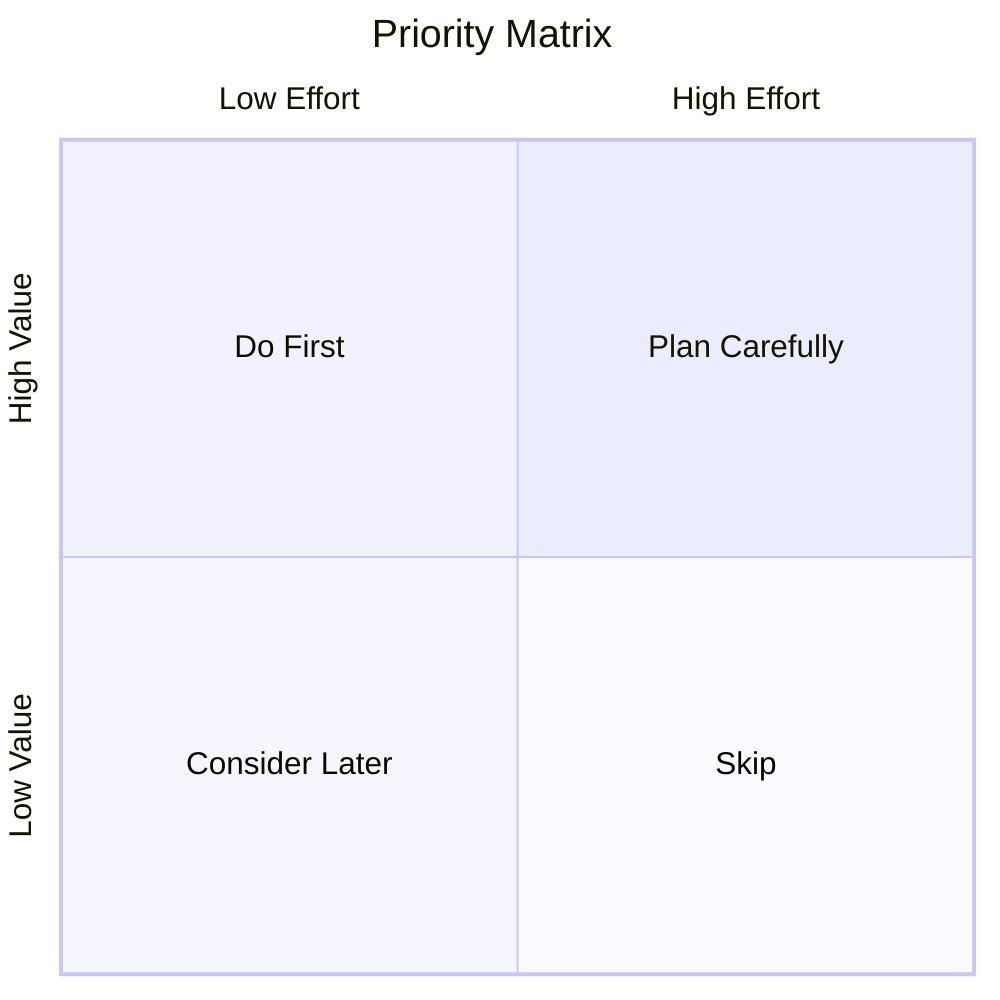

# Phase 2: Defining the Problem

> "A problem well stated is a problem half solved." — Charles Kettering

## Purpose

Transform user understanding into a clear, actionable problem statement. This phase ensures everyone agrees on what we're solving before exploring solutions.

## The Strategy Agent

**Role:** Problem framer and success definer

**Inputs:**
- Persona cards from Phase 1
- JTBD statements from Phase 1
- Context scenarios from Phase 1
- Business requirements (if any)

**Outputs:**
- Problem statement
- Success metrics
- Constraints and requirements
- Prioritized user needs

## Activities

### 1. Synthesize User Needs

Review Phase 1 artifacts and identify patterns:

| Pattern Type | Questions |
|--------------|-----------|
| **Common goals** | What do most users want to accomplish? |
| **Shared frustrations** | What problems affect multiple personas? |
| **Critical moments** | Where do users face the highest stakes? |
| **Unmet needs** | What can't they do today that they need to? |

### 2. Write the Problem Statement

Use the Point of View (POV) format:

```
[USER TYPE] needs a way to [ACCOMPLISH GOAL]
because [INSIGHT ABOUT THEIR SITUATION],
but currently [OBSTACLE/FRUSTRATION].
```

**Example:**
```
Sales managers need a way to monitor their team's pipeline health
because delayed intervention causes deals to slip,
but currently they must manually check multiple systems 
and often miss early warning signs.
```

### 3. Define Success Metrics

How will we know if we've solved the problem?

| Metric Type | Examples |
|-------------|----------|
| **Task success** | Users can complete [task] without assistance |
| **Efficiency** | Time to complete [task] reduced by X% |
| **Satisfaction** | Users rate experience X/5 or higher |
| **Adoption** | X% of users engage with [feature] |
| **Error reduction** | [Error type] decreased by X% |

**SMART Metrics:**
- **S**pecific — Clear, unambiguous measure
- **M**easurable — Quantifiable
- **A**chievable — Realistic given constraints
- **R**elevant — Connected to user goals
- **T**ime-bound — Measurable within timeframe

### 4. Document Constraints

What boundaries must we work within?

| Constraint Type | Examples |
|-----------------|----------|
| **Technical** | Must work with existing API, browser support requirements |
| **Design system** | Must use established components and tokens |
| **Accessibility** | Must meet WCAG 2.2 AA |
| **Time** | MVP needed in X weeks |
| **Scope** | V1 focuses on [subset of users/features] |

### 5. Prioritize User Needs

Use a simple priority matrix:



| Quadrant | Effort | Value | Action |
|----------|--------|-------|--------|
| **Do First** | Low | High | Quick wins, immediate impact |
| **Plan Carefully** | High | High | Strategic initiatives, schedule properly |
| **Consider Later** | Low | Low | Nice-to-haves, backlog |
| **Skip** | High | Low | Avoid, deprioritize |

### 6. Create "How Might We" Questions

Transform the problem into design challenges:

```
Problem: Users can't quickly see what needs attention

How might we...
• Surface urgent items automatically?
• Help users triage faster?
• Reduce the number of places users need to check?
• Make status visible at a glance?
• Alert users before problems escalate?
```

## Validation Gate

Before proceeding to Phase 3, verify:

| Check | Question |
|-------|----------|
| ✓ | Is the problem statement focused on user needs (not features)? |
| ✓ | Do success metrics map to user goals from Phase 1? |
| ✓ | Are constraints documented and agreed upon? |
| ✓ | Is scope clear—what's in and out for this iteration? |
| ✓ | Could someone start ideating solutions from this brief? |

## Agent Prompt Template

When invoking the Strategy Agent:

```
You are the Strategy Agent. Your role is to transform user understanding 
into a clear, actionable problem definition.

INPUTS FROM PHASE 1:
[Paste persona cards, JTBD statements, scenarios, insights]

YOUR TASK:
1. Identify the core problem to solve (synthesize patterns)
2. Write a problem statement (User needs X because Y, but Z)
3. Define 3-5 success metrics (how we'll know we've succeeded)
4. Document constraints (technical, design, accessibility, time)
5. Prioritize user needs (must-have vs nice-to-have)
6. Generate 5+ "How Might We" questions for ideation

OUTPUT FORMAT:
- Problem statement (POV format)
- Success metrics (SMART format)
- Constraints list (categorized)
- Prioritized needs (ranked)
- HMW questions (for Phase 3)

REMEMBER:
- Stay focused on PROBLEMS, not solutions yet
- Metrics should be measurable
- Constraints should be real, not assumed
- Priorities should reflect user value, not stakeholder preference
```

## Handoff to Phase 3

Package the following for the Solution Agent:

1. **Problem statement** — What we're solving
2. **Success metrics** — How we'll measure success
3. **Constraints** — Boundaries we must work within
4. **Prioritized needs** — What matters most
5. **HMW questions** — Starting points for ideation

---

**Previous:** [Phase 1: Understanding Users](./01-understand.md)
**Next:** [Phase 3: Exploring Solutions](./03-explore.md)
